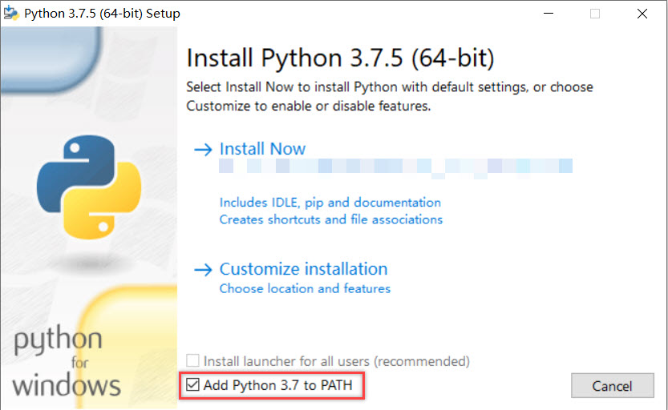
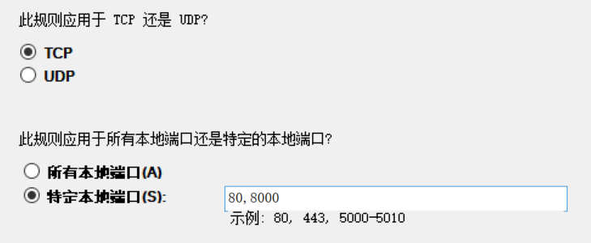

# oTree: A Crash Course

罗干松
github:https://github.com/MarvinLuoGS

This Version:20241001
Version: 1.21

[TOC]

**目标**

1. 了解python和oTree以及它们背后的一些编程概念，便于更好读懂官方文档
2. 学会基础的oTree编程，包括后端的python以及前端可能涉及的HTML+CSS+JavaScript语言
3. 基础的oTree实验运行及管理

**文件说明**

- doc：Linux系统的服务器架设方式和中文翻译的旧版本的官方文档（md格式）
- firstexp和sample_exp：oTree程序，firstexp和下面的讲解对应，sample_exp是官方的简单示例程序
- pypro：otree2stata和otree2data以及数据CSV

# 一、python及oTree基础概念与安装

oTree在更新到5版本之后，作者推荐使用的编写方式是由oTree官方自己提供的oTree studio平台，通过点击拖拽等方式写代码。因为个人没怎么用过oTree studio，所以不介绍oTree studio的使用。个人感觉虽然oTree studio比较简单但可能损失了很多灵活性，而在自己电脑上一步步写出来虽然有一点难度但能有更好的灵活性，从学习oTree的角度讲也能更有体会更深入。**本教程基于Win10系统进行，Mac OS在涉及安装、服务器架设或操作方面有差异，程序编写本身无明显差异。**

## （一）python安装及相关的编程概念

1. python解释器（Interpreter）：python是一种高级语言，计算机要理解高级语言必须要将其转换为0-1的机器语言，python解释器就是做这么一个事情。所谓安装python就是安装python解释器（python3.10/3.9/3.8是不同版本的解释器），解释器是将python代码解析/翻译为二进制机器语言的工具

   - 安装：python官网即可下载，建议下载stable release的版本，且是windows installer格式的（目前最新的版本是3.10，保证版本在3.7以上），安装的时候记得勾选Add python to PATH（如下图例子），直接选择install now即可（选择customize installation修改安装路径的话记得所有安装内容都要勾选）

     
     
     注意：如果之前已经安装过python，需要确定一下系统的环境变量里面是否已经有python的路径了，可以在系统设置里面搜索“环境变量”打开（如下图），并参考如下步骤，正确添加进环境变量应该有两条是python的路径，比较建议只保留一个版本的python的路径。环境变量下的用户变量只对当前用户有效，系统变量对所有用户有效，一般自己用的电脑上只有一个用户，所以只要用户变量下面的Path有python路径即可，安装时给所有用户都安装的选项不必要
     
     
     
     

2. 编辑器（Text Editor）：写文档要用word、做幻灯片要用PPT，写代码也要用编辑器，极端来说文本文档（txt）也可以用作编辑器。但一个好的编辑器无疑能提高效率。用于下面要介绍的IDE/类IDE工具里面同样集成了编辑器，因此这里不单独下载编辑器。

3. 集成开发环境（IDE，Integrated Development Environment）：集成集成代码编辑器、编译器、调试器和图形用户界面等功能，可以提高编写代码的效率，python自带有IDLE，另外有Jupyter Notebook、Pycharm、Spyder（主要针对python）、VSCode（针对多种语言），这里比较推荐VSCode或Pycharm

   - 安装：VSCode和Pycharm都可以直接在各自的官网下载，建议下载VSCode，下面的讲解也是基于VSCode：
     - VSCode：https://code.visualstudio.com/
     
     - Pycharm：https://www.jetbrains.com/pycharm/ ，下载免费的社区版（community）即可
     
     - Pycharm是早期的oTree文档中作为例子介绍的，这是因为早期的oTree实际上依赖于一个非常流行的开源web应用框架Django，而Pycharm本身对使用Django进行开发比较友好（对HTML+CSS+JavaScript等语言的支持），所以早期文档会以Pycharm为例子介绍，但是oTree更新到5版本之后已经不再依赖Django，而是转向使用自己的框架oTree Lite，一种和Django有点像但又不是Django的框架。安装pycharm时勾选下面这些内容：
     
       
     
     - 个人习惯使用VSCode，这也是本教程中使用的工具，可以安装很多针对不同语言的插件，但其实对使用oTree来说这些插件都不是必须的。安装VSCode时勾选下面这些内容：
       
       
       
       - 安装插件的方法是在VSCode的界面左边菜单上选择“Extensions”（扩展），然后搜索相关的扩展进行安装，下面推荐几个个人使用比较好的插件：
         - **Python**：必装，微软官方提供的VSCode的python支持插件，安装的时候认准发布者是微软官方，安装这个插件也会自动安装Pylance、Jupyter等一系列python相关插件
         - Django、Django Template：虽然最新的oTree不是基于Django，但仍有类似之处，可以安装用于辅助
         - Chinese (Simplified) Language Pack：微软官方提供的汉化包，一般打开Code自动就会提示要不要安装
         - VSCode本身的设置：点击左下角齿轮→setting→新出现的页面上搜索“BracketPairColorization”并勾选（这个功能可以使成对的括号有相同的颜色）、搜索“Linked Editing”并勾选（这个功能可以使得在修改成对的标签时只要修改一个另一个也自动替换）
         - 关于VSCode的详细的使用介绍请参考官方文档或B站上的一些教程：https://code.visualstudio.com/docs

4. 包管理工具：python安装时自带包安装和管理器pip，这是python的一个可以在python的包仓库Python Package Index(PyPI)里面下载各种python的包的工具，oTree安装将使用到这个工具。这个工具的作用有点类似于stata下载包时用的ssc install命令。pip在下载包的时候会递归地找到正在下载的包所依赖的其他包并一起下载

5. 关于python及相关安装的内容，还可以进一步参考的一些教程：

   - 最权威的资料：python官方文档：https://docs.python.org/3/
   - [Python+Anaconda+PyCharm的安装和基本使用【适合完全零基础】不只是教你如何安装，还告诉你为什么这么安装]( https://www.bilibili.com/video/BV1K7411c7EL/?share_source=copy_web&vd_source=a1d0baeb620c2ccf7c492b0edf1570c4)
   - [四十分钟Python快速入门 | 无废话且清晰流畅 | 手敲键盘 | 停止东奔西走赶快入坑吧~]( https://www.bilibili.com/video/BV1E64y1h7qP/?share_source=copy_web&vd_source=a1d0baeb620c2ccf7c492b0edf1570c4)
   - github上7.1k stars的python语言基础50课：https://github.com/jackfrued/Python-Core-50-Courses
   - 密歇根大学教授Charles Severance的入门课程：[【中英字幕】Python for everybody-不可错过的五星推荐python入门课程！](https://www.bilibili.com/video/BV16b411n7U4/?share_source=copy_web&vd_source=a1d0baeb620c2ccf7c492b0edf1570c4)
     - 教授的个人网站：https://online.dr-chuck.com/
   - oTree的官方文档提供了对python的很简单的介绍
   - 本次只会介绍最基础的python内容，其他的python应用（爬虫、数据分析以及Anaconda等等）在本次培训中不会涉及，想进一步学习的可以去找python的其他书籍或课程，入门可参考：https://www.runoob.com/python3/python3-tutorial.html

## （二）oTree的安装及相关材料

oTree是一个开源的Python框架，用于在实验经济学中设计、开发和进行在线实验。它提供了一个简单的方式来创建各种类型的实验，包括博弈论、行为经济学和社会科学实验。

注：直接采用下面的安装方法是全局安装了oTree，如果想要避免python不同的包之间相互干扰，可以先建立虚拟环境再安装，关于什么是虚拟环境以及虚拟环境如何使用，参考以下两个说明：

- [官方文档对虚拟环境的说明](https://docs.python.org/3/library/venv.html)
- [freeCodeCamp对虚拟环境的说明](https://www.freecodecamp.org/chinese/news/how-to-setup-virtual-environments-in-python/)

1. oTree的安装：根据oTree官方文档的说明，在命令行/命令提示符/cmd/终端中输入命令进行安装，首先win+R，输入cmd打开命令提示符，在打开的命令提示符窗口中输入以下命令：

   ```python
   pip install otree
   ```

   等待安装完成即可，另外一些常用命令如下：

   ```python
   pip install -U otree #升级otree
   pip uninstall #卸载某个包
   pip help #列出pip相关命令
   ```

   

   - **Path环境变量里面设定python路径的原因在此，这样将直接给该python安装上oTree包**

   - 安装完成后，同样在命令提示符窗口里面输入命令“pip show otree”可以列出otree的信息（最新的版本是5.10.3），命令“pip list”可以列出所有已安装的python包及相应版本

     

2. 学习和使用oTree的相关资料网站：
   - **oTree官方文档**：https://otree.readthedocs.io/en/latest/index.html
     - oTree 的官方文档，提供了对oTree的详细介绍和说明，在实际写程序的时候很多情况下需要开着官方文档搜索相关内容
     - 有中文版的文档，还是建议看英文的
     - 官方文档中对入门来说较为重要的章节：**Conceptual Overview、Models、Pages、Templates、Forms**
     
   - **oTree Hub**：https://www.otreehub.com/
     
     - 官方提供支持的网站，包含有论坛、用户公开的程序代码、Chris整理的一些重要的示例代码等内容，注册使用
     - **Forum**：官方论坛，可以post自己遇到的问题寻求帮助，推荐在这个官方论坛上问问题，也可以订阅邮件更新，Forum页面拉到最底下勾选通过邮件接收更新即可。（原来的讨论组是Google Groups上建立的：https://groups.google.com/g/otree?pli=1 ，也可以在上面搜索问题）
     - **Public projects/Featured**：用户分享的自己的程序代码，提供了可以运行测试的Demo、直接在网页上打开浏览的源码（Browse source code）以及代码下载（Download），Featured里面则是由Chris本人整理过的一些非常有用的代码片段或小功能，其中otree-snippets这个内容是Chris本人亲自写的，提供了很多使用例子。了解了oTree的基础内容之后，后续的学习和应用很多都是通过看和理解别人的代码完成的
     
   - oTree collection：https://ckgk.de/otree.htm
     - Christian整理的一些重要的oTree程序、实现某个功能的代码片段和工具。和hub里面的相比较主要差异是这些程序很多都是完整的高度集成的实验程序，一个程序里包含了许多不同的实验任务，程序大部分放在Git Hub上，这也说明其实可以去Git Hub上搜oTree，可以找到别人分享的代码。
     - 优点是提供了完整的实验程序，缺点是很多程序的写法是旧版本的otree代码，有一些功能在新版本中可能不支持，另外就是不那么容易看懂这些代码，需要比较多的python语言和前端语言的积累
   
   - oTree官方的Github仓库：https://github.com/oTree-org?tab=repositories
   
     - 有官方的示例程序和文档
   
   - oTree的论文，需要引用：Chen, D. L., Schonger, M., & Wickens, C. (2016). oTree—An open-source platform for laboratory, online, and field experiments. Journal of Behavioral and Experimental Finance, 9, 88-97.
   
   - （参考了解）oTree在oTree 5之前用的框架是Django，Django是一个由python编写的开源的web应用框架，由于Django框架本身已经提供或者说带有一些成熟的已经编写好的类或组件（比如表单、上传文件、滑块、评分等等功能要用到的组件），因此在这个框架基础之上进行开发无需重复造轮子，可以直接使用这些类或组件。简单来说，Django这个框架是用于服务器后端的，承担了数据库管理、数据交互等等功能，完成这些功能使用的编程语言是python，在前端（html文件）部分Django也有自己的html模板写法。现在oTree在构建前端页面的时候使用的框架是流行的Bootstrap。
   
     


# 二、oTree基础
这一节将介绍oTree编程涉及的基础概念，官方文档中对这些概念都进行了全面的介绍，这里只针对部分基础的和常用的进行介绍，深入了解这些概念还需要阅读官方文档。

## （一）编写oTree用到的语言

虽然前面介绍了python及oTree的安装，但编写otree程序并不只是涉及python一种语言，还涉及到三种语言，分别是HTML（超文本标记语言）、CSS（层叠样式表）、JavaScript。其中python用于后端，后三种语言用于前端。下面对这些语言及他们在oTree程序中承担的任务进行简单的介绍

- python语言：用于完成后端变量定义、数据交互、计算等功能的语言。与z-Tree不同的是，oTree有明确的编程思想，即面向对象编程思想。
  - 关于什么是面向对象编程，可以参考这个简短的介绍：[【8分钟搞懂面向对象编程 | 面向过程vs面向对象 | OOP | 封装 继承 多态】]( https://www.bilibili.com/video/BV1wZ4y1B7A7/?share_source=copy_web&vd_source=a1d0baeb620c2ccf7c492b0edf1570c4 )（注：这个UP主也有一个python入门课程）
  - 简单来说，面向对象是将某个任务涉及到的不同事物、属性、方法进行抽象分类，与之相对的是面向过程编程，即将完成某个任务划分成不同步骤，编写完成每一步骤的代码。
  - 就写oTree而言，**对python语言的深入了解不是必须的**，但熟悉python肯定有好处，有必要了解的基础内容有以下一些：**数值类型和数学计算、逻辑运算（与、或、非）、数据结构（元组、列表、字典、集合）、控制语句（循环和条件）、函数和模块、面向对象和类、字符串**等。python的相关教程的基础部分一般都会包含以上这些内容。
  
- HTML：一种标记语言而非编程语言，通过一套标记标签（markup tag）用于描述网页内容，即哪个地方是标题、哪个地方是文本内容、哪个地方插入图片等

  - 常见常用的一些标签

    ```html
    <p>
        段落标签
    </p>
    <ul>
        <li>无序列表</li>
    </ul>
    <ol>
        <li>有序列表</li>
    </ol>
    <div>
        块级元素，可用于组合其他元素的容器，也常用于文档布局。<span>这个则是内联元素，用来组合行内元素比如文本</span>
    </div>
    <h3>下面是一个带表头的表格</h3>
    <table>
      <tr> <!--定义表格的行-->
        <th>月份</th>  <!--定义表格的表头-->
        <th>销售</th>
      </tr>
      <tr>
        <td>一月</td> <!--定义表格的单元格-->
        <td>1000</td>
      </tr>
      <tr>
        <td>二月</td> <!--定义表格的单元格-->
        <td>2000</td>
      </tr>
    </table>
    ```

    

- CSS：描述HTML文档样式的语言，说明每个HTML文档中每个元素应该如何显示，比如字体是否加粗、标红，按键的位置、大小等等

- JavaScript：web编程语言，用于说明HTML上每个元素的动态变化、进行输入验证和数据传输等，比如当点击某个按键的时候某个文字变红、在前端验证输入的答案是否正确等

- 前端页面是直接和被试交互的，因此页面的设计很可能会影响到被试的决策，这说明编写过程中必须认真考虑前端页面的呈现。oTree本身提供的前端框架能很大程度上减少对这些语言的使用，简化了前端页面的编写过程，但是这也损失了很多自由度。当需要对前端页面进行一些调整的时候，不可避免地需要使用三门语言。这三种语言深究起来也是一个大坑，所幸上手比较容易，不一定需要精通，只要了解基础的内容，能读懂上面提到的网站中的程序例子即可。

- 实际上，oTree在生成前端页面的时候使用了一个非常流行的前端框架Bootstrap，这个框架提供了许多有用的组件和JS插件，oTree一些自带的按键、输入框等都是基于Bootstrap而来的

- 进一步了解或尝试三门语言，可以参考和查阅如下网站
  - 关于三门语言的速成入门介绍：
    - HTML：[【为初学者准备的：HTML 速成】]( https://www.bilibili.com/video/BV1vs411M7aT/?share_source=copy_web&vd_source=a1d0baeb620c2ccf7c492b0edf1570c4 )或 [【二十分钟HTML快速入门 | 无废话且清晰流畅 | 手敲键盘 | WEB前端必备语言~】]( https://www.bilibili.com/video/BV1jf4y1J7Ms/?share_source=copy_web&vd_source=a1d0baeb620c2ccf7c492b0edf1570c4)
    - CSS：[【为初学者准备的：CSS 速成】](https://www.bilibili.com/video/BV1bW411R7hg/?share_source=copy_web&vd_source=a1d0baeb620c2ccf7c492b0edf1570c4) 
    - JavaScript：[【为初学者准备的：JavaScript 速成】]( https://www.bilibili.com/video/BV1Jt411D7j6/?share_source=copy_web&vd_source=a1d0baeb620c2ccf7c492b0edf1570c4) 或[【四十分钟JavaScript快速入门 | 无废话且清晰流畅 | 手敲键盘 | WEB前端必备程序语言~】](https://www.bilibili.com/video/BV15L4y1a7or/?share_source=copy_web&vd_source=a1d0baeb620c2ccf7c492b0edf1570c4) 
  - 专门介绍web编程的教程网站，涵盖各种语言，提供了直接可运行可修改的示例：https://www.w3school.com.cn/index.html（中文） https://www.w3schools.com/default.asp（英文）
  - 菜鸟教程，同样提供了直接可运行修改的示例：https://www.runoob.com/
  - Bootstrap框架的官方文档：https://getbootstrap.com/docs/5.0/getting-started/introduction/


## （二）oTree文件与程序架构

1. 文件

- 为了了解oTree的文件类型和程序架构，我们先创建一个新的oTree程序文件夹

- 选定储存的位置（假设储存路径为E盘下的EXP文件夹），点击VSCode左上角File菜单→Open Folder打开EXP文件夹，在VSCode中打开Terminal（终端，可用快捷键Ctrl+~或点击界面左下角的图标打开，其他快捷键可参考VSCode的官方文档），此时终端中显示的路径应为“E:\EXP"

- 输入命令创建程序文件夹：

  ```python
  otree startproject firstexp
  ```

  - 在创建文件夹的时候，oTree会问是否“Inclued sample games?”，输入y并按回车将尝试联网下载样例程序在文件夹中，这些样例程序也可以作为学习的参考，但是由于样例程序可能存放在github或者别的国外平台上，所以由于某些网络原因可能无法成功下载，需要多尝试几次
  - 一般创建程序文件夹不必包括样例程序
  - 一个完整的实验的程序（比如包括不同实验任务和实验后问卷在内）叫做project

- 按照提示，输入命令将工作路径改至程序文件夹内：

  ```python
  cd firstexp
  ```

- 新建的程序文件夹没有具体的实验程序，新建实验程序需要使用命令：

  ```python
  otree startapp firstapp
  ```

  创建新的实验程序文件夹，在oTree中具体某个实验任务（比如偏好测试、问卷）的程序叫做app（有点类似于ztt）

- 在app文件夹里面，有一个名为\_\_init\_\_.py的文件和MyPage.html、Results.html两个文件，其中py文件用于实验的后端部分，html文件用于实验的前端部分

2. 程序架构

- 重要概念：Session、Subsession、Page、Group、Player、Participant

  - Session在oTree中指的是一场活动（event），这个活动中有许多参加者参加进来完成一系列的任务或游戏，官方文档提供的例子：A number of participants will come to the lab and play a public goods game, followed by a questionnaire. Participants get paid EUR 10.00 for showing up, plus their earnings from the games.

  - Subsession是Session下的一个概念，多个Subsession组成一个Session，一个Subsession可以理解为某一个实验任务、实验环节等，比如在上面的例子中，一个公共品博弈是一个Subsession，后续的问卷调查也是一个Subsession，这两个共同构成了一个Session

    - 每个Session下又由许多个Page组成，比如公共品博弈中有规则介绍、决策输入、结果报告等page，图示例子参考下图：

      

    - **如果一个任务重复多次，那么每一轮都看作一个Subsession，比如公共品博弈任务重复10次就是10个subsession**

  - Subsession又可以进一步划分为不同的Group，每个Group里面包含Player。比如在公共品博弈中，20个人平分为4个Group，每个Group5个Player，每个Player都会看到一系列的Page并作出决策。不分组的单人决策情景可以理解为一人一组

  - Participant意味参加者、被试，与之相对的Player可以理解为角色、身份，在不同的Session和Subsession之间，同一个Participant可以是不同的Player，比如在第一轮中作为委托人，在第二轮中作为代理人

  - 层级排序如下：

    - Session（一个Session包含多个Subsession，Participant参加Session）
      - Subsession（一个Subsession包含多个Group）
        - Group（一个Group包含多个Player）
          - Player（一个Player可以看到多个Page）
            - Page
  
  - 从低层级的对象向上获取高层级的对象的字段前需要使用如下写法：
  
    - player.participant/player.group/player.subsession/player.session/group.subsession/group.session/subsession.session
  
  - \_\_init\_\_.py文件的内容可以分为models和pages两部分（旧版oTree中models和pages是两个分开的py文件，新版中合并为一个），models部分有C类（常数类）、Subsession类、Group类、Player类4个类，pages部分中都是Page类
  
    - C类下的字段包括关于实验程序的名字、分组人数、轮次数等实验设置相关的字段，也可以添加一些整场实验中需要用到的不变的参数（常见的例子有投资回报率、惩罚成本等等），规范来说，C类下的变量名字全部字母大写
  
    - 从对象的角度来说，Subsession、Group、Player是不同的类，每个类有不同的字段，从数据的角度来说Subsession、Group、Player可以理解为不同的数据表，每个表的一列就叫做Field，数据就是储存在Field里面，体现为对象的字段
  
      - 例子：
  
      - ```python
        class Player(BasePlayer):
            name = models.StringField() #文本
            age = models.IntegerField() #整数
            is_student = models.BooleanField() #布尔
        ```
  
      - 每个类下面都有一些内置的字段和方法，表示这个类可以执行的一些任务或功能，关于这些内置的字段和方法以及设定方式请参考官方文档Models一节下面的介绍
  
      - 从层级来说，Subsession中的数据由同一场次的所有player共享，而Group中的数据则由该组内的Player共享
  
        - 假如Subsession下有一个字段是cost，那么该场实验中所有player调用player.subsession.cost都是得到同样的数据，无论这个player属于哪一组
        - 假如Group下有一个字段是total加总了所有人的年龄，那么第一组的人调用的player.group.total得到的是本组年龄和，第二组的人调用的player.group.total得到的是本组的年龄和，两个组调用得到的数据是不一样的
  
    - pages部分的Page类定义了参加者将看到的页面，page_sequence则定义了这些页面出现的顺序（即定义的先后不影响出现的先后，page_sequence才是控制页面先后顺序的），每一个Page都需要有对应的html文件，否则将会报错
  
      - 比如定义了一个Page名字叫MyPage并加入了page_sequence中，则必须存在MyPage.html文件，否则会报错
      - Page类同样有很多的内置方法，比较重要的有is_displayed()、vars_for_template()、before_next_page()等，同样具体的设定方式请参考官方文档Pages一节下面的介绍
      - 有一类特殊的page是WaitPage，是参加者在等待别人决策时可以看到的等待界面，由oTree内置，在需要使用的地方加入page_sequence即可，不用另外建立html文件
  
  - html文件是实验的前端部分，在页面上展示什么信息、如何展示都需要在html文件中写入
  
    - oTree基于oTree Lite框架提供了简单的Template语法，可以快速排布所需要的信息和元素，写法：
  
      ```django
      {{ block title }}
          收益情况
      {{ endblock }}
      
      {{ block content }}
      	你的收益是{{ player.payoff }}
          {{ next_button }}
      {{ endblock }}
      ```
    
  - 这个Template语言只是用于快速地展示数值，不能完成任何的计算、赋值、修改等任务，这些任务要么交由后端python完成再传向前端，要么使用JavaScript
    
  - 使用Template标记的html文件会先交由oTree系统（服务器端）扫描并转化成相应的HTML标记，再交由浏览器（被试端）根据HTML标记展示相应的网页
    
  - 可以使用HTML、CSS、JavaScript等语言灵活修改，更具体的方法可参考官方文档Templates一节的介绍


## （三）oTree运行逻辑

- \_\_init\_\_.py文件是管理后端的文件，定义了整个实验的逻辑、计算任务、数据交互等重要内容，也管理着后端与前端的交互和数据传输以及前端的页面顺序等
- html文件是前端的文件，给参加者展示了实验任务的具体信息、决策任务、实验结果等内容，一般不进行计算任务、变量赋值和数据修改等
- oTree为后端、前端文件的编写以及前后端的交互提供了方便，也为实验数据的储存、参加者的连接等提供了简单的方法，便于快速编写和开展实验
- 参加者通过浏览器获取经oTree处理的页面，在页面上进行决策，相关数据传回服务器并储存在数据库中，这个交互的过程同样由oTree帮助完成

# 三、程序编写与调试

下面开始具体的实验编写介绍，包括一个简单的调查问卷以及两个常见实验的快速实现，并介绍如何测试程序以及进阶的程序修改。这三个例子可以看作分别对应三种最基础的实验形式：单人决策、多人同时决策、多人序贯决策

## （一）简单问卷

- 我们首先实现一个简单的问卷，了解oTree的数据类型、前端的输入方式与显示方式等基础内容

- 首先将工作路径转移至上文中创建的程序文件夹（firstexp），然后输入以下命令：

  ```python
  otree startapp questionnaire
  ```

- 在问卷调查中，每个人填写的都是自己的情况，因此只需要在Player类下添加字段即可。首先，如果想要参加者填写就读的学校信息，可以按如下方式添加字段：

  ```python
  class Player(BasePlayer):
      school = models.StringField(
          label = '您就读的学校是',
      )
  ```

  这里的school是字段名，StringField表明这个字段记录的是字符型数据，label属性则是参加者在填写问卷时时可以看到的题目引导标签

- 第二个问题我们想知道参加者的年龄，可以这样添加字段：

  ```python
  age = models.IntegerField(
          min = 0,
          max = 99,
          label = '您的年龄是',
      )
  ```

  IntegerField表明age记录的是整数型的数据，这里进一步设定了该字段的最小值和最大值，当参加者填写的数据不在允许范围中时将无法提交并出现错误提示。这是第一种对输入进行验证给出错误提示的方法，这种验证方法不经过服务器。

- 接下来我们还想知道参加者的性别、年级以及是否主修经济类专业，与前面的问题不同的是，这些问题的答案可以从有限的选项中选择，因此我们可以事先给定一些选项，让参加者从选项中选择，这里使用了三种不同的常见选项展示方式：

  ```python
  	#dropdown menu
      gender = models.IntegerField(
          choices = [
              [0,'女'],
              [1,'男'],
          ],
          label = '您的性别是',
      )
      #horizontal radio buttons
      grade = models.IntegerField(
          choices = [
              [1,'大一'],
              [2,'大二'],
              [3,'大三'],
              [4,'大四'],
              [5,'硕士生'],
              [6,'博士生'],
          ],
          widget = widgets.RadioSelectHorizontal,
          label = '您的年级'
      )
      #vertical radio buttons
      major = models.BooleanField(
          choice = [
              [False,'否'],
              [True,'是'],
          ],
          widget = widgets.RadioSelect,
          label = '您是否主修经济类专业？',
      )
  ```

  这三个字段中，都事先设定了choice参数，choice参数是一个列表，列表的元素还是列表，每个列表里面的第一个元素是数据的取值，比如整数型的1、2、3，布尔型的True和False，第二个元素是与这个数据取值绑定的选项文本，也就是参加者可以在前端看到的选项字样。widget参数控制了选项的展示形式，gender字段中没有指定widget参数，默认会以下拉菜单的形式展示；grade字段制定widget为widgets.RadioSelectHorizontal，则六个选项水平排列，而major字段指定widgets.RadioSelect则选项垂直排列

- 在问卷中有一些问题不要求所有人都回答，这个时候可以指定参数blank：

  ```python
  suggest = models.LongStringField(
          blank = True,
          label = '如果您有意见或建议，请填写在下框中',
      )
  ```

  blank为True表明在填写时该字段可以留空，需要被试填入数据的字段默认是不允许留空的，另外这里使用的LongStringField在输入时会显示更大的文本框

- 另外，有的时候我们也想要对参加者输入的数据进行验证（比如测试性问题检验答案是否正确），上面提到的设定最大最小值参数的方法不适用，我们在这里添加一个attention字段用于举例说明如何进行输入的验证，注意这个验证需要在PAGES部分指定，将在下面讲解

  ```python
      attention = models.IntegerField(
          label = '请在下框内填入1234以提交本页'
      )
  ```

- 上面完成了后端MODELS部分的设定，下面是有关问卷页面的PAGES部分设定，这一部分内容的主要功能是管理前端页面的逻辑、数据输入以及运算等等。在问卷调查这个例子中，我们需要两个页面，第一个页面是参加者填写问卷，第二个页面是展示参加者刚刚填写的信息。

- 第一个页面完成输入任务，如果参加者需要在页面上填入数据，那么这个页面需要设定form_model和form_fields，以说明当前页面需要填写哪些字段以及这些字段来自哪一类，这里参加者需要填写的是player类下的一些字段：

  ```python
  class Questionnaire(Page):
      form_model = 'player'
      form_fields = ['school','age','gender','grade','major','suggest','attention']
  
      @staticmethod
      def error_message(player,values):
          if values['attention'] != 1234:
              return '输入有误！'
  ```

  注意这一页面进行了上面提到的输入验证，这个验证方法定义了一个staticmethod（静态方法，这是一个python面向对象编程里面比较专业的概念，只需要知道要这样写就可以，下面的例子中出现的静态方法同理），这个方法的名字叫error_message，定义了这个方法后oTree会在运行的时候自动调用这个方法，因此可以理解为一个内置的方法叫error_message，我们只需要填写需要验证的内容，oTree会根据填写的内容进行验证。

  这里需要判断的是attention的输入值是否是1234，values参数（这里出现的values只是这个参数的一个记号，统一改成别的名字也可以）的数据类型是字典，表示执行的时候传入的是一个字典，这个字典包含了在页面上输入的所有字段。根据attention这个字典的key（键）可以获取相应的value（值），并判断是否等于1234，如果不等于，则返回return后面的错误提示，这个错误提示会显示在页面上方。

  第一个页面的html文件内容非常简单，由于我们已经设定好了字段以及相应的题目标签作为引导，在html文件中只需要写入如下内容即可：

  ```django
  {{ block title }}
      问卷调查
  {{ endblock }}
  {{ block content }}
  
      {{ formfields }}
      
      {{ next_button }}
  {{ endblock }}
  ```

  oTree在生成网页时会自行解释花括号中的内容，转换为标准的html文件供浏览器显示。其中{{ formfields }}会自动生成form_fields中设定的待填写字段，{{ next_button }}会生成一个提交按键。

  - 这里的内置的错误提示形式需要通过服务器进行验证，可以理解为学生交卷，老师改卷。另一种可行的方法是在前端借助JavaScript进行验证，即学生自己对答案并订正后才交回给老师。由于涉及到不少JavaScript的内容，不进行展开，具体的代码可以参考附带的代码示例。

  - 为什么还需要这样一种前端验证方法？一个直接的原因是减轻服务器的运算负担，这个时候传回的数据服务器不需要再进行验证了；第二个原因是，如果在生成待输入字段的时候没有使用oTree自带的花括号形式（除{{ formfields }}外的其他形式参考官方文档Forms一节的内容），而是用原生HTML语言的\<input\>标签等生成输入框，这个时候生成的输入框在样式和逻辑上都会有很大不一样。
    - 使用{{ formfields }}生成的输入框在页面字段经验证存在错误后不会清空先前已填写的内容。
    - 假如一个页面上有这么一个输入框使用了原生HTML标签，并且参加者已经填入了某个值。这个页面经后端验证后存在错误需要重新填写，这个时候参加者那边重新显示的页面上不会保留先前已填写的值，需要重新填写。为了避免这种情况出现，所以采用前端验证的方式而不经过服务器。
    - 这也可以看出oTree自带的元素或功能其实包含很多细微的特点和方便之处

  显示的页面如下：

  

- 第二个页面中我们想要展示被试刚刚输入的内容，一般来说可以在前端中直接调用相应的字段，但有的时候我们想要展示的是一些简单计算过得到的数据或者是依据某个条件进行展示。参考下面的例子：

- py文件：

  ```python
  class Results(Page):
      
      @staticmethod
      def vars_for_template(player):
          if player.gender == 0:
              gender_text = '女'
          else:
              gender_text = '男'
          if player.grade <= 4:
              grade_text = '本科生'
          else:
              grade_text = '研究生'
          return dict(
              gender_text = gender_text,
              grade_text = grade_text
          )
  ```

  这里使用的静态方法是vars_for_template，这个方法可以在后端进行一些计算或赋值得到需要在前端进行展示的变量，这个方法返回的值是一个字典，前端页面可以直接调用字典的key（键）显示相应的值。在上面的例子中，dict是生成字典的一个方法，等号左边是字典的键，右边是字典的值，前端调用的是字典的键。例子中是根据先前输入的数据得到不同的文本，并用于展示。

- 相应的html文件：

  ```django
  {{ block title }}
      问卷内容展示
  {{ endblock }}
  
  {{ block content }}
      <p> 您就读的学校是 {{ player.school }}</p>
      <p> 您的年龄是 {{ player.age }}</p>
      <p> 您的性别是 {{ gender_text }}</p>
      <p> 您现在是 {{ grade_text }}</p>
      {{ if player.major == True}}
      <p> 您<b>主修</b>经济类专业</p>
      {{ else }}
      <p> 您<b>不主修</b>经济类专业</p>
      {{ endif }}
      
  {{ endblock }}
  ```

  这个例子中，学校和年龄是直接调用显示输入的数据，性别和年级则是调用vars_for_template中返回的字典中键，主修专业这里使用了花括号的条件语句。

  显示的页面如下：注意下面出现的Debug info是用于程序调试的，每一页都会有，正式实验的时候需要关闭（参考正式实验操作下面的程序准备）

  

- 在设定好页面之后，记得在py文件中的page_sequence中设定好页面顺序

  ```python
  page_sequence = [Questionnaire, Results]
  ```

  至此完成简单问卷的例子编写。

## （二）公共品博弈

- 下面介绍的是公共品博弈的编写例子，一些已在前面的例子中介绍的内容不再赘述

- 新建一个公共品博弈的app文件夹，在公共品博弈中，有两个全局层面的常数，一个是参加者的禀赋，另一个是投入禀赋之后的放大倍数，这种常数可以在C类中定义：

  ```python
  class C(BaseConstants):
      NAME_IN_URL = 'publicgood'
      PLAYERS_PER_GROUP = 3
      NUM_ROUNDS = 5
  
      ENDOWMENT = cu(200)
      MULTIPLIER = 2
  ```

  - 这里的禀赋的写法表示这个数值是货币型的数值，如果设置了USE_POINTS为True，则表示200点（关于点数和收益的问题，参考（五）中的处理点数和收益以及官方文档Currency一节的内容），MULTIPLIER设置为2
  - NAME_IN_URL的字符会出现在进入实验后浏览器显示的网址中，PLAYERS_PER_GROUP设定了小组人数为3（若无小组，则设定为None），NUM_ROUNDS设定了轮次为5
  - 注意python里面所有的常数的名字应该全部用大写字母

- 公共品博弈的决策是个体决定自己的贡献额，而计算公共品投资回报则需要在小组层面进行计算，因此需要在Group类下定义小组总贡献额和回报，在Player类下定义贡献额

  ```python
  class Group(BaseGroup):
      total_contribution = models.CurrencyField()
      individual_share = models.CurrencyField()
  
  
  class Player(BasePlayer):
      contribution = models.CurrencyField(
          min = 0,
          max = C.ENDOWMENT,
          label = "请输入您的贡献额"
      )
  ```

  - 如果在Player类下定义总贡献额或回报也是可以的，这个时候就需要想办法调用同组内其他人的贡献额数据进行计算（可以自行尝试这种写法，参考官方文档Multiplayers games一节下面Group小节的内容，需要用到get_others_in_group()这个内置方法），写在Group类中调用更方便

- 到这里就定义完成所需要的字段了，在这一部分还剩余两个问题：①如何分组？②如何计算收益？

  - 关于分组，这里设定5轮都是随机匹配，需要用到内置的随机分组方法：

    ```python
    def creating_session(subsession):
        subsession.group_randomly()
    ```

    - 这里定义的creating_session是一个函数，不需要定义在某个类下面。def creating_session(subsession)是一个内置的函数，用于在开始实验前设定分组、角色等内容，名字写法固定。在启动实验时，名为creating_session的函数会被自动调用执行
    - subsession.group_randomly()是每轮随机分组的内置方法（关于分组和角色分配，参考（五）的“group和role的设定”相关内容）

  - 关于计算收益，需要自行设定收益计算函数并调用（单独写收益计算函数可以提高代码可读性，也便于修改和查找问题）

    ```python
    def set_payoffs(group:Group):
        player_list = group.get_players() #获得包含小组内所有玩家的列表
        contribution_list = [p.contribution for p in player_list] #获得小组内所有贡献额列表
        group.total_contribution = sum(contribution_list) #求得贡献额总和
        group.individual_share = group.total_contribution * C.MULTIPLIER / C.PLAYERS_PER_GROUP
        for p in player_list: #对小组内的每一个玩家，减去自己的贡献额后加上分得的收益
            p.payoff = C.ENDOWMENT - p.contribution + group.individual_share
    ```

    - 由于小组内的三人收益是共同决定的，因此从小组层面进行计算
    - (group:Group)表示的意思是：group是函数需要的参数的标记，Group是这个参数建议取的值为Group类，这样写是提醒作用，防止在后面调用的时候出错

  - 下面是PAGES部分的内容，这一任务分为两个页面，第一个页面是输入贡献额，第二个页面是报告收益，由于输入贡献额的速度有快慢，因此需要添加等待页面等待小组内或所有人完成决策后再进入收益报告

  - 贡献决策页面如下：

    ```python
    class Contribution(Page):
        form_model = 'player'
        form_fields = ['contribution']
    ```

    对应的html文件如下：

    ```django
    {{ block title }}
        第{{ player.round_number }}轮决策
    {{ endblock }}
    
    {{ block content }}
    
        <p>
            <ul>
                <li>在这个实验中你和另外两人随机配对，组内共有{{ C.PLAYERS_PER_GROUP }}人。</li>
                <li>每人都有实验点{{ C.ENDOWMENT }}。</li>
                <li>投入公共池中的实验点会乘以{{ C.MULTIPLIER }}。</li>
            </ul>
        </p>
    
    
        {{ formfields }}
    
        {{ next_button }}
    
    {{ endblock }}
    ```

    显示如下：

    
  
  - 完成就决策后，需要一个WaitPage让参加者等待。WaitPage不需要在文件夹下写对应的html文件，只需要在py文件里设定即可。这里的等待有两种方式，第一种是等待同组三人都完成进入等待界面后，等待结束，进入下一页收益报告，第二种写法是等待在场所有人都完成后才一起进入下一页，下面给出两种写法：
  
    ```python
    class ResultsWaitPage(WaitPage):
        title_text = '请耐心等待！'
        body_text = '请保持安静，如果有问题，请询问实验员。'
    
        @staticmethod
        def after_all_players_arrive(group: Group):
            set_payoffs(group)
        
        #wait_for_all_groups = True
        #@staticmethod
        #def after_all_players_arrive(subsession: Subsession):
        #    group_list = subsession.get_groups()
        #    for g in group_list:
        #        set_payoffs(g)
    ```

    - title_text和body_text设定了等待页面显示的标题和文本内容

    - after_all_players_arrive是一个内置的方法，表示等待所有人（group或subsession）到达这一页面后才执行，第一种方法是等待同组所有人都到达之后才执行，因此传入的参数是group，直接调用前面定义的收益计算函数即可
  
    - 第二种方法（注释掉的方法）中首先设定了wait_for_all_groups = True，表示要等所有小组都到达了才执行，这个时候after_all_players_arrive必须是一个subsession的方法，传入subsession参数，然后再对subsession里面的小组逐一执行收益计算函数
  
    - 等待页面显示如下：
  
      
  
  - 最后的收益报告不需要在py文件里写代码，html如下：
  
    ```django
    {{ block title }}
        第{{ player.round_number }}轮收益报告
    {{ endblock }}
    
    {{ block content }}
    
        <p>
            <ul>
                <li>本轮你投入了{{ player.contribution }}。</li>
                <li>小组总的贡献额是{{ group.total_contribution }}。</li>
                <li>组内每人可分得{{ group.individual_share }}。</li>
                <li>你的本轮收益是{{ player.payoff }}。</li>
            </ul>
        </p>
        {{ if player.round_number == C.NUM_ROUNDS }}
        <p>
            你的{{ C.NUM_ROUNDS }}轮总收益是{{ participant.payoff }}。
        </p>
        {{ endif }}
    
        {{ next_button }}
    
    {{ endblock }}
    ```
  
    - 唯一需要说明的是，这里调用了payoff和participant下的payoff，payoff是内置的用于统计收益的字段，payoff和participant类下都有这个字段，直接调用即可（关于这个字段的说明，参考（五）中的处理点数和收益）
  
    - 显示如下：
  
      
  
  - 最后的安排页面顺序：在重复多轮的实验中，这些页面会重复出现
  
    ```python
    page_sequence = [Contribution, ResultsWaitPage, Results]
    ```
  
    至此完成一个简单的公共品博弈的编写。

## （三）信任博弈

- 下面介绍的是信任博弈的编写例子，一些已在前面的例子中介绍的内容不再赘述

- 新建一个信任博弈的app文件夹，与前面的博弈不同的是，信任博弈不仅有分组，还是一个序贯博弈，需要区分角色和决策的先后

- 信任博弈的两个参数是初始禀赋和投资的放大倍数，同样这两个参数写在C类下

  ```python
  class C(BaseConstants):
      NAME_IN_URL = 'trust_game'
      PLAYERS_PER_GROUP = 2
      NUM_ROUNDS = 5
      
      ENDOWMENT = cu(100)
      MULTIPLIER = 3
  ```

- 信任博弈的决策是角色A决定发送的点数，角色B决定的是返还的点数，这两个决策都是在两人配对的小组Group层面做出的（同样，另一种写法是将这个决策写在Player类下面）。在Group类下添加两个字段：

  ```python
  class Group(BaseGroup):
      sent_amount = models.CurrencyField(
          min=cu(0),
          max=C.ENDOWMENT,
          label="请输入您要发送的点数",
      )
      sent_back_amount = models.CurrencyField(
          min=cu(0),
          label="请输入您要返还的点数："
          )
  ```

- 对sent_amount的范围限定是显然的，但是sent_back_amount的上限则是不确定的，需要根据发送额确定。这种属于动态的验证。这里只需要确定返还额的上限，因此使用的是{{field_name}}_max()的函数：

  ```python
  def sent_back_amount_max(group: Group):
      return group.sent_amount * C.MULTIPLIER
  ```

  {{field_name}}\_max()这种格式定义的函数会被自动执行，用于实验中动态确定上限，类似的函数还有{{field_name}}\_min()等（更多验证方法参考官方文档Forms一节下面的Dynamic form field validation的内容）。

- 下面要定义的是收益计算函数：

  ```python
  def set_payoffs(group: Group):
      p1 = group.get_player_by_id(1)
      p2 = group.get_player_by_id(2)
      p1.payoff = C.ENDOWMENT - group.sent_amount + group.sent_back_amount
      p2.payoff = group.sent_amount * C.MULTIPLIER - group.sent_back_amount
  ```

  这里使用了group内置的get_player_by_id()的方法，这个方法用于在组内寻找某个有id_in_group的角色，这里的player1是先行动的角色A，player2是后行动的角色B，角色的分配由oTree根据分组情况随机设定，因此可以不手写角色分配代码（关于角色分配，参考（五）的group和role的设定这部分）

- 最后确定分组方式，采用随机分组方式的同时，又需要保证参加者的角色固定，因此设定如下参数：

  ```python
  def creating_session(subsession):
      subsession.group_randomly(fixed_id_in_group=True)
  ```

  fixed_id_in_group取值True即可保证在随机分组时id_in_group即角色不变

- 下面是PAGES部分的内容，考虑博弈时序，需要决策的页面有发送和返还两个，而小组内不同角色还需要等待对方决策，因此还要有两个WaitPage，最后还要加上结果报告的页面。除此以外，我们还想在实验开始前提供简短的实验说明并且告知参加者他们的角色。

- 我们首先考虑作为实验介绍的开始页，在这一页上提供简短的实验说明以及告知角色，另外，这一页仅需要在第一轮出现，在第二轮重复的时候，这一页不再出现，因此还需要设定显示条件：

  ```python
  class Introduction(Page):
      
      @staticmethod
      def vars_for_template(player: Player):
          if player.id_in_group == 1:
              role_text = '角色A'
          else:
              role_text = '角色B'
          return dict(
              role_text = role_text
          )
      
      @staticmethod
      def is_displayed(player: Player):
          return player.round_number == 1
  ```

  - 设定显示条件用到的方法是is_displayed，return后的判断条件满足才会显示页面，这里设定仅在第一轮显示

- Introduction页面需要着重介绍的在html页面中，首先这里给出示例代码：

  ```django
  {{ block title }}
      实验介绍
  {{ endblock }}
  {{ block content }}
  
      {{ include_sibling 'instructions.html' }} <!-- 外部插入实验说明 -->
  
      <p><b>
          您的角色是： {{ role_text }}
      </b></p>
      
      <button class="otree-btn-next btn btn-primary" id="btn" style='float:right'>请阅读实验说明（20）</button>
      <!-- 使用了oTree内置的button的class -->
  
      <script>
          var btn = document.getElementById('btn'); //获取元素
          var secs = 20; //设定了倒计时为20秒
          btn.disabled=true; //禁止点击
          for (var i=1; i<=secs; i++) {
              window.setTimeout("update(" + i + ")", i * 1000);
          } //每1秒执行一次update函数
          function update(num) {
              if (num==secs) { //倒计时结束，按键的文本改变，并且可以点击
                  btn.textContent = "开始实验";
                  btn.disabled = false;
              }
              else { //倒计时中，实时更新文本里面的数字
                  var printnr = secs - num;
                  btn.textContent = "请阅读任务说明 (" + printnr + ")";
              }
          }
  	</script>
  {{ endblock }}
  ```

  - 可以看到，这里并没有出现实验说明，而是使用了插入html的方式在这个页面上插入了实验说明，格式是{{ include_sibling 'instructions.html' }}，这是oTree自带的一个写法，可以方便地在页面上插入其他内容，特别是那些需要重复出现的内容
    - 一个好处是，如果需要修改实验说明等需要重复出现的内容，只需要修改一个文件即可，不用修改多个文件，大大降低了代码重复度
    
    - 这种方式插入的html内容和主页面的html文件放在同一个文件夹即可
    
    - 有的时候CSS和JS的代码会作为单独的文件保存在\_static文件夹中，这些文件的读取方式参考官方文档Miscellaneous→Advanced features→Static files的内容，例子：
    
      ```django
      <link rel="stylesheet" href="{{ static 'mystyle.css' }}">
      <script src="{{ static 'myscript.js' }}"></script>
      ```
    
  - 第二个需要说明的是这里使用了一个有点复杂的自定义按键，这个按键在20秒之内是无法点击的，只有20秒之后才能点击进入下一页，这强制要求参加者停留一段事件阅读说明
  - **注意**：在static文件夹中保存的css和js文件很可能并不会随着修改而实时更新，这是因为启动了一次server之后，浏览器将js文件和css文件缓存下来了，因此即使本地修改了css和js文件，浏览器可能还是会使用修改前缓存的文件。为了让新修改的文件起效，可以进行一次全页面的刷新（**full page reload，一般的快捷键是Ctrl+F5**）

    - 参考代码解释理解，JavaScript的作用就是获取页面上的任一个元素并进行动态实时的更新，包括这些元素的内容、属性、样式等等

    - 倒计时未结束：

      

    - 倒计时结束：

      

- 第一个决策页面是发送决策，需要限定只有角色A（id_in_group==1）才会显示，而角色B则等待：

  ```python
  class Send(Page):
      form_model = 'group'
      form_fields = ['sent_amount']
  
      @staticmethod
      def is_displayed(player: Player):
          return player.id_in_group == 1
      
      
  class SendBackWaitPage(WaitPage):
      title_text = '请耐心等待！'
      body_text = '请保持安静，如果有问题，请询问实验员。'
  ```

  对应的发送决策页面，这里在页面下方插入了实验说明：

  ```django
  {{ block title }}
      角色A决策-第{{ player.round_number }}轮
  {{ endblock }}
  {{ block content }}
  
      <p>
          您是角色A。您有实验点{{C.ENDOWMENT}}。您会发送多少给角色B？
      </p>
  
      {{ formfields }}
      <p>
      {{ next_button }}
      </p>
  
      {{ include_sibling 'instructions.html' }}
  
  {{ endblock }}
  ```

  显示页面如下：

  

- 第二个决策是返还决策，这个页面只显示给角色B（id_in_group==2），角色A进入等待界面，在角色B完成决策后，计算最后的收益：

  ```python
  class SendBack(Page):
      form_model = 'group'
      form_fields = ['sent_back_amount']
  
      @staticmethod
      def is_displayed(player: Player):
          return player.id_in_group == 2
  
      @staticmethod
      def vars_for_template(player: Player):
          group = player.group
          tripled_amount = group.sent_amount * C.MULTIPLIER
          return dict(tripled_amount=tripled_amount)
  
  
  class ResultsWaitPage(WaitPage):
      title_text = '请耐心等待！'
      body_text = '请保持安静，如果有问题，请询问实验员。'
  
      after_all_players_arrive = set_payoffs
  ```

  这里的after_all_players_arrive = set_payoffs是一种简写形式，和上一例子中的写法是一样的作用，注意这里没有设定wait_for_all_groups，默认为False，只需要当前轮次的小组成员到达即可

  对应的返还决策页面如下：

  ```django
  {{ block title }}
      角色B决策-第{{ player.round_number }}轮
  {{ endblock }}
  {{ block content }}
  
      <p>
          您是角色B。
          角色A发送了实验点{{ group.sent_amount }}，因此你获得实验点{{ tripled_amount }}。
          您将会返还多少实验点给角色A？
      </p>
  
      {{ formfields }}
      <p>
      {{ next_button }}
      </p>
  
      {{ include_sibling 'instructions.html' }}
  
  {{ endblock }}
  ```

  显示如下：

  

- 最后是收益报告的页面：

  ```python
  class Results(Page):
  
      @staticmethod
      def vars_for_template(player: Player):
          group = player.group
  
          return dict(tripled_amount=group.sent_amount * C.MULTIPLIER)
  ```

  对应的html：

  ```django
  {{ block title }}
  收益报告-第{{ player.round_number }}轮
  {{ endblock }}
  {{ block content }}
  
      {{ if player.id_in_group == 1 }}
          <p>
              本轮您有实验点{{ C.ENDOWMENT }}，
              您发送给角色B {{ group.sent_amount }}，
              角色B返还 {{ group.sent_back_amount }}。
          </p>
          <p>
              本轮您的收益点数:
              {{ C.ENDOWMENT }}-{{ group.sent_amount }}+{{ group.sent_back_amount }}=<strong>{{ player.payoff }}</strong>
          </p>
      {{ else }}
          <p>
              角色A发送给您 {{ group.sent_amount }}，
              放大后您的点数是 {{ tripled_amount }}，
              您返还了 {{ group.sent_back_amount }}。
          </p>
          <p>
              本轮您的收益点数:
              ({{ tripled_amount }})-({{ group.sent_back_amount }})=<strong>{{ player.payoff }}</strong>
          </p>
      {{ endif }}
  
      {{ if player.round_number == C.NUM_ROUNDS }}
          <p>
              在{{ C.NUM_ROUNDS }}轮中，您一共获得实验点{{ participant.payoff }}
          </p>
      {{ endif }}
  
      <p>{{ next_button }}</p>
  
  
  {{ endblock }}
  ```

- 两个角色的收益报告：

  

  

- 页面顺序如下：Introduction仅在第一轮显示

  ```python
  page_sequence = [
      Introduction,
      Send,
      SendBackWaitPage,
      SendBack,
      ResultsWaitPage,
      Results,
  ]
  ```

  至此完成简单的信任博弈的编写

## （四）程序测试

- 在编写好程序后，首先需要在自己的电脑上进行调试。在调试前需要在settings.py中进行一些设定：以上面编写的三个程序为例，在SESSION_CONFIGS中填入内容：

  ```python
  SESSION_CONFIGS = [
       dict(
           name = 'questionnaire',
           display_name = 'questionnaire',
           app_sequence = ['questionnaire'],
           num_demo_participants = 2,
      ),
      dict(
           name = 'publicgood',
           display_name = 'publicgood',
           app_sequence = ['publicgood'],
           num_demo_participants = 6,
      ),
      dict(
           name = 'trustgame',
           display_name = 'trustgame',
           app_sequence = ['trustgame'],
           num_demo_participants = 2,
      ),
  ]
  ```

  - name和display_name保持一致即可，display_name是后台看到的名字
  - app_sequence可以添加多个app在列表中，app将按顺序执行
  - num_demo_participants是测试的时候生成的参加者链接数量，注意要是程序中设定的每组最小人数的倍数

- 在终端中将路径转移至程序文件夹，使用如下命令启动测试服务器：

  ```python
  otree devserver
  ```

- 输入命令后，正常启动的服务器会显示下图的内容：本地服务器的地址是localhost:8000，关闭服务器的快捷键是Ctrl+C

  

- 按住ALt（或Ctrl，取决于设置）点击链接可以快速打开服务器，进入服务器后台，可以看到Demo列表，点进需要测试的程序即启动相应的实验demo

  

- 在实验的后台可以看到有不同的标签页，默认展示的是Links标签页，下面的链接可以点击打开用于测试

  

- Monitor页是观察实验进展的，发生变动的参加者该行会变绿然后逐渐变淡

  

- Data页可以看到数据，同样发生变动的单元格会变绿然后逐渐变淡

  

- Payment记录了支付信息

  

- oTree在测试过程中可以直接对代码进行修改，保存后通过刷新或者点击New就可以使修改生效，不用关闭测试服务器

## （五）对程序的扩展说明

### 1. 处理点数和收益

- 在上面的例子中，涉及点数和收益的转化时都使用了currencyfield，通过settings.py中修改相关设置直接将点数转换为实际货币收益
- settings.py中与currencyfield和收益相关的设置：

  - real_world_currency_per_point：每1点实验点等于多少现实货币，在计算收益payoff时会自动作用于其中的currencyfield
  - participation_fee：出场费
  - REAL_WORLD_CURRENCY_CODE：指定使用的真实货币，人民币是CNY
  - USE_POINTS：设定为True会将实验中出现的货币字段的单位转换为点数；设定为False表明不在实验中使用实验点数作为单位，这也将使得real_world_currency_per_point失效
    - 假设设定real_world_currency_per_point=0.50, participation_fee=10.00，REAL_WORLD_CURRENCY_CODE = 'CNY'，参加者在实验中获得了20，数据保存在earned这个currencyfield中，并直接作为收益payoff（可修改附带的程序进一步测试理解）
      - 如果设定USE_POINTS为True，则earned、player和participant两个类下面的payoff都使用点数作为单位，参加者获得的点数是20，最终收益是：$20\times0.5 + 10 =20$元
      - 如果设定USE_POINTS为False，则earned、player和participant两个类下面的payoff都直接使用货币“元”作为单位，real_world_currency_per_point不再起作用，最终的收益是$20+10=30$元
      - 一般使用USE_POINTS=True
- player和participant中的payoff：player和participant中都有内置的字段payoff，得到的收益应该写入payoff字段中，如前所述，一个participant可能有很多player（比如很多轮次/subsession），因此participant中的payoff就是自动加总所有subsession中payoff的一个总payoff

  - 在计算player.payoff的时候需要自己定义收益计算的函数，并在后续的某个页面或某个环节中进行调用，比如在多轮博弈中设定每一轮都会计算一次player.payoff
  - oTree并没有一个内置的类似TotalPayoff的概念，起加总作用的是participant中的payoff，在只有一轮的时候，两个payoff相等，在多轮的时候，participant.payoff起加总的作用
  - participant.payoff也是可以进行修改的，比如四舍五入、取整等等

  - participant自带payoff字段，因此跨app调用的时候不需要写在PARTICIPANT_FIELDS中（调用数据的内容见下面第3点）
  - participant的payoff还没有加上出场费，最终参加者可以拿到的钱（后台Payment标签下显示的数字）是经过换算的payoff加上participation_fee得到的
  - participant_payoff_plus_partipation_fee()是内置的计算最终现金收益的方法，可以用于前端的输出展示等
- 在处理收益上，如果需要对不同实验任务采用不同的收益率，那么可以在不同实验中计算payoff的时候写入不同的比例，而不使用统一的real_world_currency_per_point（设置为1并把USE_POINTS设定为True即可，所有比例换算都手动完成），有的时候甚至不一定使用CurrencyField而使用IntegerField或FloatField，也即所有的运算都通过自定的函数进行，最终只需记得将结果存入payoff

### 2. 自定义数据输出格式

- otree的数据导出默认会将所有内置的字段以及自定义的字段统一导出，另外也可以自行指定需要输出的字段（变量）

- 在实验app的\_\_init\_\_.py文件中，定义如下的custom_export函数（以上面处理点数与收益的currency程序为例）：

  ```python
  def custom_export(players):
      # 定义表头
      yield ['session_code', ' participant_code', 'id_in_group', 'earned', 'payoff']
      for p in players:
          participant = p.participant
          session = p.session
          # 定义输出的数据对应字段
          yield [session.code, participant.code, p.id_in_group, p.earned, p.payoff]
  ```

- 这个函数定义了需要输出的字段以及它们在数据文件中相应的表头，定义完成后otree后台会自动执行，无需调用，针对不同的app可以定义和导出不同数据字段
- 具体的数据下载操作参考后续[“数据下载与文件类型”](#（二）数据下载与文件类型)

### 3. Timer的设定

- 默认中页面没有结束的限制时间，只有在提交或达成其他设定条件时才会结束当前页面进入下一页面

- 需要设定页面的限制时间时，涉及两个内置的字段：time_out_seconds和timer_text

- 内置倒计时方法：设定time_out_seconds设定了页面总时间，设定timer_text设定倒计时的文本提示语，注意，内置的倒计时会在时间耗尽后自动跳过当前页面，即使当前页面信息或决策没有填完也会提交

  - 在需要设定倒计时的Page中设定即可，不需要在html文件中写倒计时内容，oTree会自动在页面上调用内置的otree-timer

  - ```python
    class Timer1(Page):
        timeout_seconds = 20
        timer_text = '当前页面的剩余时间'
    ```

  - 一个拓展：在倒计时仅剩10秒时才显示时间，在html上添加如下的css和js代码：

  - ```html
    <style>
        .otree-timer {
            display: none;
        }
    </style>
    
    <script>
        let customTimerEle = document.getElementById('time-left');
        document.addEventListener("DOMContentLoaded", function (event) {
            $('.otree-timer__time-left').on('update.countdown', function (event) {
                if (event.offset.totalSeconds === 10) {
                    $('.otree-timer').show();
                };
            });
        });
    </script>
    ```

- 内置倒计时也可以对样式进行自定义，参考下面的例子：

  - ```python
    class Timer2(Page):
        timeout_seconds = 20
    ```

  - ```html
    <style>
        .otree-timer {
            display: none;
        }
    </style>
    
    <p>
        剩余 <span id="time-left"></span> 秒
    </p>
    
    <script>
        let customTimerEle = document.getElementById('time-left');
        document.addEventListener("DOMContentLoaded", function (event) {
            $('.otree-timer__time-left').on('update.countdown', function (event) {
                customTimerEle.innerText = event.offset.totalSeconds;
            });
        });
    </script>
    ```

- 有的时候我们并不需要一个自动提交的页面，倒计时仅起到催促、提醒的软约束作用，这个时候的倒计时就不能使用oTree自带的倒计时功能，而应该使用JS实现

  - 最简单的方式：使用浏览器弹窗进行提醒，倒计时结束后浏览器弹窗，弹窗文本内容为alert里面的内容

  - ```html
    <script>
        setTimeout(
            function () {
                alert("倒计时结束，请做出决策！");
            },
            10*1000 // 60 seconds
        );
    </script>
    ```

  - 这种方法在页面上没有显示时间，要实现页面上显示倒计时比较复杂，参考如下的代码：

  - ```html
    <p id="timer_posi">剩余时间：</p>
    <button class="otree-btn-next btn btn-primary" id="btn" style='float:left'>下一页</button>
    <script>
    //点击按键提交当前页面后，清楚原来存储的countDown，这样在多轮实验需要复用这一页面时，在新一轮中倒计时会从头开始
    //如果不清楚countDown，在后面的轮此重新进入这一页面时，由于已经记录了countDown，会认为倒计时已经结束，从而不会重新开始倒计时
    const myButton = document.getElementById('btn');
    myButton.addEventListener('click', removeItem);
    function removeItem(){
        sessionStorage.removeItem('countDown');
    }
    //自己设定的倒计时，倒计时结束不会提交当前页面
    $(document).ready(function(){
        window.onload = function(){
            var time;
            //获取待修改元素
            var pTime = document.getElementById('timer_posi');
            //设定倒计时的分和秒
            var m = 0;
            var s = 30;
            var total_time = m*60+s;
            //防止页面刷新重新开始倒计时的代码
            //如果在能找到某个值countDown，则说明已刷新过
            if(sessionStorage.getItem('countDown')){
                time = sessionStorage.getItem('countDown'); 
                var time1 = new Date().getTime(); //获取当前时间
                var remain_time = total_time - (time1-time)/1000 //获取剩余时间（s)
                m = Math.floor(remain_time/60);
                if (remain_time < 60){
                    s = Math.floor(remain_time);
                };
                if (remain_time >= 60){
                    s = Math.floor(remain_time - m*60)
                };
                //m = m - Math.floor((time1-time)/1000/60); //倒计时时长-(现在时间-开始时间)=剩余时长
                //s = s - Math.floor((time1-time)/1000%60);
            }else{
                time = new Date().getTime(); //没有刷新过，则获取当前时间作为页面开始时间，并保存为countDown
                sessionStorage.setItem('countDown',time);
    
            };
            //设定计时器，利用setInterval(function(),1000)，表示每过1秒（1000毫秒）执行一次function()
            var timer = setInterval(function(){
                //如果上一次秒是00，则改变取值：比如4：00后显示3：59
                if(s == '00' && m > 0){
                    s = 59;
                    m--;
                } else{ //否则只是秒值递减
                    s--;
                };
                //如果秒值是0-9，则拼接一个0，显示为“01”形式
                if(s >= 0 && s <10){
                    s = '0' + Number(s)
                };
                //如果分值是0-9，则拼接一个0，显示为“01”形式
                if(m >= 0 && m <10){
                    m = '0' + Number(m)
                }
                //拼接字符串，用于显示
                time_text = "剩余时间："+m+":"+s;
                pTime.innerHTML = time_text;
                //在倒计时结束后，额外添加加红加粗的提醒语
                if (s <= 0 && m <= 0) {
                    clearInterval(timer); //使用这个代码将在倒计时结束后清除倒计时，最终只会显示00：00
                    //如果不使用这个代码，秒上的取值会为负，比如“00:-4”
                    time_text = "剩余时间：00:00";
                    pTime.innerHTML = time_text + '<p><b><font color=\'red\'>请尽快决策！</font></b></p>';
                }
            },1000)
        };
    })
    </script>
    ```

### 4. round和app之间的数据传递

- 在oTree中每一轮的subsession、group和player对象都是独立的，在第一轮输入的数据并不会传递至第二轮

- 为了获得前一轮或者前面某些轮次中的数据，需要借助subsession、group和player对象内置的方法：

  - in_previous_rounds()：返回一个列表，列表元素为前面所有轮次中的对象，比如10轮时player.in_previous_round()返回的列表元素是前面9轮的player对象
  - in_all_rounds()：和上一个的区别是返回的列表包括当前轮次对象
  - in_rounds(m,n)：返回m至n轮的对象组成的列表
  - in_round(m)：返回m轮的对象，比如返回前一轮的player对象是player.in_round(player.round_number - 1)

- 在app之间进行传递，则需要使用到Participant fields，将需要的数据存到participant对象中，首先需要在setting.py中设定PARTICIPANT_FIELDS

- 一个简单的在round和app之间传递数据的例子如下（注意：下面的例子仅展示部分代码，subsession、group等没有修改保持默认的类不展示，完整代码参考附带的程序文件夹）：

  - 在第一个app中，设定NUM_ROUNDS = 2：

    - ```python
      class C(BaseConstants):
          NAME_IN_URL = 'pass_data_part1'
          PLAYERS_PER_GROUP = None
          NUM_ROUNDS = 2
      ```

  - 在Player类中设定一个字段用于储存数据：

    - ```python
      class Player(BasePlayer):
          pass_number = models.IntegerField(label='输入一个数字用于在round和app之间传递')
      ```

  - MyPage仅在第一轮出现，用于输入数据，并向Participant传递数据

    - ```python
      class MyPage(Page):
          form_model = 'player'
          form_fields = ['pass_number']
      
          @staticmethod
          def before_next_page(player: Player, timeout_happened):
              participant = player.participant #获取player的participant
              participant.pass_number = player.pass_number #将player的pass_number传给participant
          	#participant.var这样的写法就是使用participant类中的字段
          @staticmethod
          def is_displayed(player: Player):
              return player.round_number == 1
      ```

    - 相应的MyPage.html写法：

    - ```django
      {{ block title }}
          输入数字
      {{ endblock }}
      {{ block content }}
          <p>这是第{{ player.round_number }}轮</p>
          {{ formfields }}
          {{ next_button }}
      
      {{ endblock }}
      
      ```

  - Results仅在第二轮出现，获取第一轮输入的数据并展示在页面上

    - ```python
      class Results(Page):
          
          @staticmethod
          def vars_for_template(player: Player):
              prev_player = player.in_round(1) #获取第一轮的player对象
              number_round_1 = prev_player.pass_number
              return dict(
                  number_round_1 = number_round_1 #为页面展示准备的变量
                  #前端不允许player.in_round(1).pass_number这样的写法，所以需要转换以下
              )
          
          @staticmethod
          def is_displayed(player: Player):
              return player.round_number == 2
      ```

    - 相应的Results.html写法：

    - ```django
      {{ block title }}
          展示数字
      {{ endblock }}
      
      {{ block content }}
          <p>这是同一app的第{{ player.round_number }}轮</p>
          <p>你在上一轮中输入的数字是{{ number_round_1 }}</p> 
          {{ next_button }}
      {{ endblock }}
      ```

  - 第二个app的Resultes直接从Participant中获取数据并展示

    - ```django
      {{ block title }}
          第二个app-展示数字
      {{ endblock }}
      
      {{ block content }}
      
          <p>
              在前一个app中你输入的数字是<b>{{ participant.pass_number }}</b>
          </p>
      {{ endblock }}
      ```

  - 在setttins.py中设定PARTICIPANT_FIELDS：

    ```python
    PARTICIPANT_FIELDS = ['pass_number']
    ```

### 5. group和role的设定

- 在实验中不可避免地会遇到分组匹配和角色分配的问题，比如独裁者博弈、信任博弈等，如何在oTree中进行随机的分组和角色分配？

- 内置的重要变量或字段：

  - group：每个参加者都有一个group的字段表明参加者所属的组别

  - id_in_group：参加者在自己小组内的组内id，取值为1、2、3……，取值与在C类中设定的PLAYERS_PER_GROUP有关，这个变量实际上是区分了不同的角色，因为oTree的角色是按Player 1/Player 2这样定义的，id_in_group = i即为Player i。无论是否对不同角色设定了不同任务，这个id序号分配都会自动进行

  - role：这个字段也用于指示角色，取值取决于id_in_group，与id_in_group不同的是这个字段可以取字符型的值，在C类中定义的以“_ROLE”结尾的变量的值将会按顺序赋值给id_in_group=1，2，3的被试（参见下面的例子）

  - 在下面说明的分组与角色分配方式的例子中，我们以2人一组的委托代理博弈为例，首先在C类中添加如下的两个角色变量

  - ```python
        PRINCIPAL_ROLE = 'principal'
        AGENT_ROLE = 'agent'
    ```

- **内置分组与角色分配方式**

  - oTree自带了随机分组和分角色的功能，即对被试的group和id_in_group进行随机分配

  - 如果什么分组方法都不设定，默认的分组方法下是固定匹配和固定角色（即固定的id_in_group），并且匹配方式必定是P1和P2匹配，P3和P4匹配（以2人一组为例），而id_in_group是按1、2、1、2……这样的顺序依次安排，即P1和P3是1，P2和P4是2，因此采用内置函数分配时“随机”是在给被试分配编号（比如抽实验说明）时完成的

  - 设定分组方法（无论是用内置的函数还是另外的分配方法）都要定义一个creating_session函数并在其中进行（注意这个函数不是在某一个类下定义的）

  - 如果每轮都进行随机匹配，且不存在角色，使用内置的分组函数如下：

  - ```python
    def creating_session(subsession):
        subsession.group_randomly() #随机匹配的内置方法
        print(subsession.get_group_matrix()) #输出分组结果的矩阵，所有轮次的匹配结果矩阵将会依次打印在终端上
    ```

  - 如果每轮都进行随机匹配，且需要固定角色，使用内置的分组函数如下：

  - ```python
    def creating_session(subsession):
        subsession.group_randomly(fixed_id_in_group=True) #设定fixed_id_in_group可以在重新分组时保持角色不变
        print(subsession.get_group_matrix()) #输出分组结果的矩阵，所有轮次的匹配结果矩阵将会依次打印在终端上
    ```

  - 内置的分组和角色分配函数有一个可能的缺点是它只能按P1、P2、P3的顺序进行分配，如果在实验室中对固定的电脑设定固定的编号的话（设定方式参考下面正式实验操作一节中的程序准备内容），这样造成的结果是：1号电脑总是同一个角色，2号电脑总是另一个角色，如果固定匹配的话，1号电脑和2号电脑总是分在一组。另一方面，如果想要实现另外的一些匹配方式也需要进行自行设定随机和分配方式

- **自定分组与角色分配方式**

  - 要进行自定义的分组方式，首先要理解oTree以什么作为分组的依据，或者说分组函数以什么作为输入值

  - oTree进行分组时依赖于方法set_group_matrix()，这个方法以matrix作为输入值，但是python里面并没有“矩阵”这样的数据结果，所以这里的matrix实际上是一个嵌套的列表，比如：[[1,2],[4,3]]

  - 在角色分配上，id_in_group是在分组后自行按顺序分配的，以[[1,2],[4,3]]这个分组矩阵为例，第一个子列表中的第一个元素是1，所以P1的id_in_group是1，第二个子列表中第一个元素是4，所以P4的id_in_group是1。所以只要确定好分组矩阵，就决定好了分组和角色分配方式

  - 因此所有的分组和角色分配的问题归结为，如何获得一个分组矩阵？用python的语言来说，如何获得一个嵌套列表？我们以上面提到的经典分配方式为例，手动实现。以下的代码例子仅作为参考，熟悉python有更优更简洁的写法

  - 利用内置的group、id_in_group和role字段的好处是有一些内置的方法可以就是以这些字段作为输入的（比如找到某个组的人、找到某个角色的人，具体可参考官方文档Multiplayer games一节下面的Group小节）

  - 固定匹配和固定角色的情况下，只需要在第一轮做好随机分配即可，后续轮次复制第一轮的结果即可，与内置方法的差异是，P1不一定和P2匹配：

  - ```python
    def creating_session(subsession):
        import random #python中用于生成随机数的的一个包，一般python自带
        #固定角色和固定搭配的情况下，只需要在第一轮做好随机分配即可，后续轮次复制第1轮的结果即可，与内置方法的差异是P1不一定和P2匹配了
        if subsession.round_number == 1:
            num_participant = len(subsession.get_players()) #获得实际的参加人数，get_players返回的是一个列表
            participant_list = [ x for x in range(1,num_participant+1)] #生成一个[1,2,3,4,5,6]这样的列表，这个列表将用于后续的矩阵生成
            random.shuffle(participant_list) #随机步骤，将列表打乱
            group_matrix = [] #生成一个空的列表，往其中添加元素生成矩阵
            for i in range(1,int(num_participant/C.PLAYERS_PER_GROUP) + 1): #要分几个组，就往其中填入几个空列表作为元素
                group_matrix.append([])
                i += 1
            i = 0
            for li in group_matrix: #对group_matrix里面的每个空列表进行循环，往其中依次填入数字
                while len(li) < C.PLAYERS_PER_GROUP: #在空列表中的元素个数没达到小组人数时依次往里面填入数字，达到小组人数时停止填入，继续往下一个列表填入
                    li.append(participant_list[i])
                    i += 1
            subsession.set_group_matrix(group_matrix) #所有的空列表都填充完成，分组矩阵已生成，使用set_group_matrix进行分组
        else:
            subsession.group_like_round(1) #通过group_like_round()复制第1轮的分组结果
        print(subsession.get_group_matrix()) #输出所有轮次分组匹配的结果matrix，可以看到所有轮次中的matrix都是一样的
    ```

  - 每轮随机匹配，且不存在角色的情况下，实际上是固定匹配中第一轮的随机分组代码每轮执行一次即可，与内置方法没有特别大的差异：

  - ```python
    def creating_session(subsession):
        import random #python中用于生成随机数的的一个包，一般python自带
        #无固定角色+每轮随机匹配，实际上就是所有被试都是相同角色然后进行随机匹配和上面的区别就是后续的轮次不用复制第一轮的结果，每轮都是重新随机
        num_participant = len(subsession.get_players())
        participant_list = [ x for x in range(1,num_participant+1)]
        random.shuffle(participant_list)
        group_matrix = []
        for i in range(1,int(num_participant/C.PLAYERS_PER_GROUP) + 1):
            group_matrix.append([])
            i += 1
        i = 0
        for li in group_matrix:
            while len(li) < C.PLAYERS_PER_GROUP:
                li.append(participant_list[i])
                i += 1
        subsession.set_group_matrix(group_matrix)
        print(subsession.get_group_matrix())
    ```

  - 每轮随机匹配，但角色固定，这个时候的重点在于如何实现随机分配角色，并将不同角色进行匹配，下面的方法与内置方法相比差异在于不再按顺序分配id_in_group：

  - 在分配之前，首先需要在C类中额外增加一个变量以指示角色数量：

  - ```python
    R_NUM = 2
    ```

  - 在Subsession类中增加一个字段用于储存角色列表：

  - ```python
    class Subsession(BaseSubsession):
        role_list = models.StringField()
    ```

  - 具体的写法如下：

  - ```python
    def creating_session(subsession):
        import random
        #有固定角色+每轮随机匹配，分配的重点在于随机分配角色，并将不同角色之间进行匹配，和内置方法相比不再按顺序分配id_in_group
        num_participant = len(subsession.get_players()) #获得实际的参加人数，get_players返回的是一个列表
        if subsession.round_number == 1: #这里的第一轮要随机生成的一个列表只是角色编号的列表，比如[2,1,1,2,1,2]
            role_list = [x for x in range(1,C.R_NUM+1)] * int(num_participant/C.PLAYERS_PER_GROUP) #将[1,2]这样的列表按组数扩展
            random.shuffle(role_list) #将角色列表随机排列
            subsession.role_list = str(role_list) #将随机后的角色列表以字符型格式保存（为什么这样保存？）
        else:
            prev_subsession = subsession.in_round(1) #后续的轮次找到第1轮的subsession对象（为什么是对象？）
            subsession.role_list = prev_subsession.role_list #将第1轮的subsession对象的role_list字段复制过来，就获得了角色分配列表
        ####由于拿来的是字符串，带有括号和空格等字符，所以需要去除不必要的字符、拼合为列表、将列表的字符型的数字转换为数值型
        role_list = subsession.role_list.strip("[")
        role_list = role_list.strip("]")
        role_list = role_list.replace(" ","")
        role_list = role_list.split(",")
        role_list = list(map(eval,role_list))
        ##########
        ##已经获得角色分配列表后，下一步是按角色进行匹配，思路是将被试按角色分为两个pool，每次匹配分别从两个pool拿出一个进行匹配
        role_list_temp = [x for x in range(1,C.R_NUM+1)] #作为分组对照的列表[1,2]
        role_matrix = [] #将角色分为两个pool，包含两个pool的矩阵
        for i in range(1,C.R_NUM+1): #按角色数量先生成对应数量的空列表
            role_matrix.append([])
            i += 1
        ##先分配好第一个角色pool，再分配第二个角色pool，另一种实现方法是将这个时候获得的role_matrix储存起来，同样需要考虑如何将字符串转化为列表
        for j in range(0,C.R_NUM):
            for i in range(0,num_participant):
                if role_list[i] == role_list_temp[j]:
                    role_matrix[j].append(i+1)
            j += 1
        ##每个pool里面进行随机
        for j in range(0,C.R_NUM):
            random.shuffle(role_matrix[j])
            j += 1
        ##用于分组的matrix
        group_matrix = []
        for i in range(1,int(num_participant/C.PLAYERS_PER_GROUP) + 1):
            group_matrix.append([])
            i += 1
        ##按角色往分组matrix里面放入编号
        i = 0
        while i < int(num_participant/C.PLAYERS_PER_GROUP): #i表示组别
            for j in range(0,C.R_NUM): #j表示角色编号
                group_matrix[i].append(role_matrix[j][i]) #先往i组里放入角色j，再放入角色j+1
                j += 1 
            i += 1 #i组中已放入j、j+1角色，i组的分配已完成，分配i+1组，直到分配完所有组
        subsession.set_group_matrix(group_matrix) #当轮分组矩阵已生成，使用set_group_matrix进行分组
        print(subsession.get_group_matrix())
    ```

  - 了解这些自定分组方式的目的在于了解oTree如何通过group_matrix设定分组，另一方面通过这个例子也说明**如何将oTree编程的问题转化为一个python的问题**，从python的角度思考如何解决问题，更一般地说，遇到了别的编程问题，最重要的也是将问题转化为用编程语言表达（python怎么实现某某功能/JavaScript如何实现某个功能等等），弄清楚问题的本质才能问百度谷歌必应乃至ChatGPT
  
  - 在creating_session里面定义的分组和角色分配会在session创建时（即开始实验时）就执行，此时参加者还没有进行任何的决策。有的时候，分组和角色分配是在session创建之后依据一定规则确定的（比如参加者自行决定，或依据某个决策进行分组），这个时候就不应该在creating_session里进行，而应该借助WaitPage
  
    - ```python
      class ShuffleGroup(WaitPage):
          wait_for_all_groups = True
          
          @staticmethod
          def after_all_players_arrive(subsession): 
              #设定wait_for_all_groups之后，after_all_players_arrive需要以subsession作为参数
              subsession.group_randomly()
              #各种分组代码等
      ```
  
    - 从这里也可以看到，要实现更灵活的分组和角色分配需要手动写分组代码设定所需要的group_matrix，而这归根到底就是生成所需要的矩阵（以列表为元素的嵌套列表）
  

# 四、正式实验操作
## （一）服务器架设

1. 安装数据库PostgreSQL和psycopg2包

   oTree自带的数据库是SQLite，据官方文档所说这个数据库在面对短时大量的访问时表现不好，因此建议换用更正式性能更好的PostgreSQL数据库。下面的例子中使用**14版本的PostgreSQL**。

   - PostgreSQL的官方网站：https://www.postgresql.org/

   - 下载地址：https://www.enterprisedb.com/downloads/postgres-postgresql-downloads

   - 安装要点：

     1. 所有可选的安装项都选上

        

     2. data文件夹目录和程序文件夹一致（默认）

        

     3. 设定superuser权限用户**postgres的密码（重要）**

        

     4. 端口保持默认5432即可

        

     5. locale保持默认即可

        

     6. stack builder不用launch

        

2. psycopg2是python的一个与数据库进行交互的包，可直接使用pip命令安装：pip install psycopg2

3. 新建数据库并修改环境变量

   - 打开新安装的postgreSQL的管理界面（名字应该是pgAdmin4）后还会要求设置一个master密码，防止搞混设置为和superuser一样的密码即可。点开左边Servers，输入postgres用户的密码连接，在下面展开的菜单下找到DataBase，右键打开菜单选择Create→Database，输入新的Database的名字（例子中为otree），保存即可。

     

     

     

   - **在修改数据库环境变量前，记得关闭所有的VSCode窗口，然后再去修改环境变量，如果在开着VSCode的时候修改环境变量，新修改的环境变量不会起作用，必须关闭然后重新打开VSCode才能生效**

     - （可选）以前似乎在关闭VSCode之前还需要关闭终端再重启VSCode才能生效，现在应该不用，如果需要关闭终端，点下图红框中的垃圾桶图标：

       

   - 打开修改环境变量的窗口（参考上面安装python时的步骤），在用户变量（系统变量也可）里面添加新的变量DATABASE_URL，变量值结构为：postgres://postgres:\<password\>@localhost/\<database name\>，括号里面的内容填入自己设置的密码和数据库名称即可

     

   - 修改完成后，打开VSCode中的终端或cmd，输入python启动python，依次输入如下命令：

     ```python
     import os
     os.environ["DATABASE_URL"]
     ```

     如果看到正确输出了刚刚设置的数据库环境变量（如下图），则正确设置和读取环境变量，然后输入quit()退出python即可

     

   - 在VSCode终端或cmd中打开任意一个otree程序文件夹或将路径更改至某个otree程序文件夹，输入命令“otree resetdb"后按提示操作，Database engine显示“postgresql”即表示成功设置数据库

     

   - （可选）按上述步骤做下来可以正常运行，如果不能，之前的官方文档里面还建议尝试如下修改：在postgreSQL文件夹里面找到data文件夹下面的pg_hba.conf文件，文本文档格式打开，拉到最后IPv4和IPv6里面最后的METHOD的值都改成trust

     

4. 端口入站规则修改

   - 打开“高级安全Windows Defender防火墙”

     

   - 点击左边“入站规则”，然后点击右边“新建规则”

     

   - 规则类型选择“端口”

     

   - 规则应用于TCP，特定端口输入"80,8000"

     

   - 下一页选择“允许连接”

     

   - 何时应用该规则都选上

     

   - 最后一页的名称自定义（例子为otree）

     

   - 测试连接：找到自己电脑当前的IPv4地址（一般在当前网络连接的属性里面可以查看），VSCode终端或cmd打开任意一个otree程序文件夹或将路径更改至某个otree程序文件夹，输入命令“otree prodserver [ip adress]: 8000”，括号内填入自己的ip地址，然后在浏览器输入地址“ [ip adress]: 8000”连接，正常进入后台即连接成功，后续可以用别的电脑或手机进一步测试

5. 以上是在windows系统的电脑或服务器上的设置步骤，如果是Linux系统的服务器，参考另一个文档：[Linux Server old version-edited](./doc/Linux Server old version-edited.docx)

## （二）程序准备

1. 准备Rooms和Participant label

   - 使用otree启动正式实验需要通过otree自带的Room功能，可以理解为开启一个（虚拟的）“实验室”，每场实验都需要开启一次实验室，label就是这个“实验室”中的座位编号。label的作用就是给每个被试编号，方便在后台观察被试进展，也用于在实验网页被关闭的时候方便被试进入原来的页面接着完成实验（相当于方便被试找到座位）。

   - 创建Rooms首先在程序文件夹里面新建一个文件夹名为“_rooms”，在里面新建文本文档，写入设定的参加者的label作为label file，如下图例子：

     

   - 在settings.py里面加入ROOMS的设定，如下图例子，一个room设定是一个字典dict：

     ```python
     ROOMS = [
         dict(
             name = 'Econ',
             display_name = 'Econ',
             participant_label_file = '_rooms/Econ.txt',
             #use_secure_urls = True,
         )
     ]
     ```

     - name是显示在浏览器网址栏的名字，可修改

     - display_name是显示在oTree后台的Rooms列表的名字，可修改

     - participant_label_file是label file的路径

     - use_secure_urls可以给显示的网址进一步加密，可选用，参考下面的例子

        ```
         #未加密
         http://localhost:8000/room/econ101/?participant_label=Student1
         http://localhost:8000/room/econ101/?participant_label=Student2
         #加密
         http://localhost:8000/room/econ101/?participant_label=Student1&hash=29cd655f
         http://localhost:8000/room/econ101/?participant_label=Student2&hash=46d9f31d
        ```

   - 以上完成了rooms和label的设置。下一个问题是，在启动实验后，oTree后台不是按照label的顺序排列被试，而是按照正式启动实验后，连接的先后顺序排列被试。以101、103、105、107被试为例，我们希望在后台他们按照这个顺序连接，但有可能107号被试先连接上服务器进而出现在后台Monitor的第一位。因此需要额外加一段代码，使得被试在后台是按照label的顺序排列的，代码如下：

     ```python
     def creating_session(subsession):
        file_path = '_rooms/Econ.txt'
        with open(file_path,'r') as file:
          label = file.readlines()
          labels = [int(line.strip()) for line in label]
         for p,label in zip(subsession.get_players(),labels):
             p.participant.label = label
     ```

     这一段代码需要添加在实验程序运行的**第一个app的\_\_init\_\_.py**文件中，不用放在某一个类里面。这一段代码首先读取了存储有label的txt文件，该文件内保存有101、103、105、107四个label，将其读取并整理为一个列表，最后将这个列表与subsession中的player一一对应。这样在后台Monitor中，被试的label就会按照我们指定的顺序排列。

   - **（可选）**在进行多场次实验的时候，还可以在creating_session中添加的内容是session.label。这是因为，oTree启动每一个session时会随机生成一串code作为session.code，这个值可以区分不同场次，但是不够直观，而session自带了label字段。因此可以在creating_session中指定session.label，这样下载的数据中就带有直观的label作为区分。这里获取不同场次开始实验的时间并格式化，作为session的label

     ```python
     def creating_session(subsession):
         import datetime as dt
         session = subsession.session
         now = dt.datetime.now()
         format_date = now.strftime("%Y-%m-%d %H:%M:%S")
         session.label = format_date
     ```

2. 关闭debug mode

   - debug mode是在测试的时候使用的，会在每个页面下显示当前页面的相关变量信息，以及出问题的时候提示具体信息，在正式实验的时候需要关闭

   - 关闭方式是在实验程序的settings.py文件中赋值：

     ```python
     DEBUG = False #改为True即开启debug mode
     ```

3. 改变内置界面的语言

   - 内置的等待页面等界面上原来默认显示的是英文语句，可以在settings.py文件中修改语言，即可显示中文：

     ```python
     LANGUAGE_CODE = 'zh-hans'
     ```

4. **（可选）**实验后台登录密码

   - otree启动后在同一网络环境中的设备都可以输入相应的服务器ip连接后台，添加后登录密码后在连接后台后必须输入密码才能使用后台的功能，但这不是必须要设置的

   - 在settings.py中有如下两个变量：

     ```python
     ADMIN_USERNAME = 'admin'
     ADMIN_PASSWORD = environ.get('OTREE_ADMIN_PASSWORD')
     ```

     第一个变量设定了后台管理的用户名，第二个设定了登录密码

   - 登录密码可以在环境变量中添加OTREE_ADMIN_PASSWORD设置，变量的值即为登录密码

   - 还可以设置程序的权限等级：在环境变量中添加OTREE_AUTH_LEVEL，正式实验可设置为STUDY，网络公开供其他人参考的程序样例一般会设置值为DEMO

   - 另外一个有关的环境变量是OTREE_PRODUCTION，这是另一种控制debug模式的开关，如果设置为True（1），则关闭debug mode，如果设置为False（0），则开启debug mode

## （三）启动实验

1. 启动实验的命令

   启动实验前，重置一下数据库（关于数据库和数据的保存的具体内容，参考第五节）：

   ```python
   otree resetdb
   ```

   在完成所有准备工作后，在VSCode或cmd终端里面，将工作路径改为程序文件夹，输入启动正式实验的命令：otree prodserver [ip address]:8000，参考下面的例子，注意修改ip地址
   
   ```python
   otree prodserver 192.168.1.1:8000
   ```
   
   另外，也可以省略后面的IP地址，只输入otree prodserver命令，同样可以启动服务器
   
   正常启动后，在电脑浏览器上输入IP地址即可连接后台，如：192.168.1.1:8000（或者输入**http://**192.168.1.1:8000），如果先前设置了后台登录密码，输入密码登录进入后台，可以看到如下所示的界面：
   
   - 在实验所使用的网络环境中，别的电脑、手机、平板等网络设备同样可以输入后台网址连接后台，不一定需要在作为主机的电脑上连接后台
   
   
   
2. 检查服务器

   检查服务器，点击上方菜单的Server Check，尤其注意DEBUG mode和数据库的情况，保证DEBUG mode已关闭，数据库为Postgres
   
   
   
   
   
3. 通过Rooms启动实验

   - 记住不能点击DEMO列表启动实验，这样不是正式的实验session，点击DEMO列表会马上启动demo session，这样数据文件里会有来自demo session的数据行

   - 点击上方菜单的Rooms，可以看到已设定的Rooms列表，点击

     

   - 进入Rooms的设定界面，上面可设置人数，人数和\_\_inti\_\_.py文件中设定的PLAYERS_PER_GROUP有关，需要是该值的倍数，先不要点击Create，等待连接

     

   - 设定界面的下方是被试连接情况以及用于连接的网址，有专用网址和房间网址，使用专用网址不用手动输入label，使用房间网址则需要手动输入编号，为方便分发，可以使用房间网址

     - 从下图例子中可以方便地看到101和105已连接，103和107未连接
     - 如果使用手机、平板等设备方便扫描二维码的话，可以使用插件将房间网址转化为二维码进行分发，扫描二维码后即可进行连接（参考谷歌浏览器插件Quick QR，安装后在房间网址上右键菜单中可生成二维码）

     

4. 被试端操作

   - 如果使用房间网址连接，首先进入如下输入页面，需要手动输入label，

     

   - 输入label后或直接使用专用链接，此时实验员没有点击Create的话则进入如下的等待界面

     

   - 这两个内置页面默认为英文，需要修改才能显示为中文：在settings.py中的LANGUAGE_CODE变量赋值“zh-hans”

5. 正式启动

   - 连接完成后点击Create，启动实验session

   - 如果已按前面的步骤设定了label，则在Monitor中可以看到所有被试按label排列，可以方便地通过Progress、App、Round、Page name等列观察被试进展

     

   - Advance slowest user(s)在正式实验中不要点，会让被试强制跳过当前页面，即使有未输入的决策，这会造成数据缺失
   
   - 实验完成后，重新点进Rooms中刚刚启动的room可以看到下图，点close this room即表示房间关闭实验结束，后续同一实验的其他场次可以使用同样的room设置启动新的场次，每一个room设定同时只能有一个active session，可以理解为实验室被占用
   
     
   
   - 当然也可以一个场次给一个room的设置，在settings.py的ROOMS加入更多room设定即可

## （四）问题处理

- oTree的后台运行非常稳定，只要服务器运行正常网络不中断即可。即使主机中断（Ctrl+C）了，及时重启也能继续实验，重新启动后通过菜单Rooms→Econ仍可以看到在进行的实验（active session），点击“Go to active session”进入即可

  - 这也说明，如果出现的bug不涉及数据库的改变（比如增加或减少字段），一些网页显示上的bug可以及时处理
  - 由于正式实验用到了数据库，因此中途换主机非常麻烦，所以一定要保证主机正常
  - 如果真的发生了问题主机需要转移，则需要参考如下的步骤
    - 将原主机上的数据库备份导出（导出步骤参考下面的数据管理部分），和实验程序一起转移到一个新电脑上，这个新电脑同样应该配置好python、oTree、PostgreSQL、环境变量等服务器相关配置
    - 打开PostgreSQL的管理界面pgAdmin，新建数据库，将原数据重载至新数据库中（重载操作同样参考下面数据管理部分）
    - 修改新电脑的环境变量，确保数据库名字是刚刚新建的已重载数据的数据库
    - 重新启动实验程序，通过Rooms菜单进入active session，后台的数据应已正常导入，可以继续实验
      - 如果使用的是局域网，尽可能地把新电脑的ip地址改为和原来的ip地址一样
      - 如果无法修改新电脑的ip地址，则被试端应该重新输入网址和label进入

- 如果被试中途出现断网或掉线的情况，重新联网后刷新页面或在浏览记录里点开原链接即可

- 如果被试关掉了实验网页，就重新进入room链接，输入label，即可继续原来中断的实验

- 实验链接不识别机器，被试设备中途出故障换用其他机器同样可以通过输入链接重新连接继续实验，这也是room和label的重要作用

# 五、数据保存与基础清洗
## （一）数据管理

- oTree使用了两种数据库：PostgreSQL和SQLite，分别用于正式实验和测试debug

  - 测试数据库是基于SQLite的，测试程序时生成的数据库文件是程序文件夹下面的db.sqlite3文件，删除这个文件后再启动测试服务器又会新建这个文件，即完成测试数据库的重建
  - 启动实验前重置的是用于正式实验的基于PostgreSQL的数据库，下面讲的数据管理也是针对这个正式实验的数据库

- 考虑如下图所示的情况，我们有一个名字叫otree的正式实验数据库，然后我们有三个实验Project，每个实验下又有若干个app

  

  - 在第一天我们首先进行了Project1的正式实验，通过Room启动了正式的Session。这个实验由三个App（实验任务）组成，在运行完上午的场次后，数据库otree里面已经保存了上午场次的数据，而下午将进行第二个场次。
  - **对同一个实验的不同场次，中途不需要重置数据库，下一场（session）的数据会作为新数据增加在数据文件末尾**，等所有场次做完后，所有场次的数据都在一个csv文件里。（当然保险起见可以做完一场下载一次数据）
  - 完成Project1的实验后，所有的正式数据都存在数据库中。
  - 在第二天我们要进行Project2的正式实验，在进行新的project之前，可以**进行备份数据库然后重建数据库的操作**，这样Project2会将数据存放在一个新的空数据库中
  - 同理在第三天进行Project3的正式实验时也进行这样的操作
  - 总结一个**建议**就是，**在进行同一个实验的不同场次时可以不用重置数据库，在进行不同实验之前确保下载好和备份好数据并重置数据库**

- **（可选）**备份（Backup）和重载（Restore)数据库的操作

  - 这部分操作涉及到PostgreSQL的操作，**不是必须的**，其中有一些SQL的细节也没有完全清楚

  - 要进行备份和重载操作，首先需要做如下设定：左上角File菜单→Preference，在弹出的窗口中下拉找到Paths选项，在Binary paths子选项中找到PostgreSQL Binary Path，我们使用了14版本，所以在该行的Binary Path中选择安装文件夹下面的bin文件夹，并保存。

    

  - 备份操作：打开pgAdmin4，在原有的实验数据库（上面的例子中这个数据库叫otree）上点右键，在右键菜单中选择Backup

    

  - 在弹出的框中选择保存的路径和文件名，格式Format选择Custom或Tar均可，点击右下角Backup即完成备份

    

  - 重载操作：打开pgAdmin4，新建一个数据库（上面的例子中数据库名字叫otree，假设新建的数据库名字叫otree_backup），**注意这个数据库必须是新建的空白的，不能被用于启动任何的oTree实验**。右键数据库，在右键菜单中选择Restore

    

  - 在新弹出的窗口中Format选择Custom or tar，Filename选择数据库备份文件，点击右下角Restore即完成重载
  
    
  
  - 修改环境变量中的DATABASE_URL（修改方法和注意事项见前文），将原来的数据库名字改成刚刚重载的数据库（在例子中是将otree改成otree_backup），然后重新打开VSCoed并启动（prodserver）原来的实验Project，即可在后台的Data菜单重新下载数据


## （二）数据下载与文件类型

- 点击最上方的菜单中的Data标签可以进入数据下载页面

- 在页面上可以看到三个不同的数据文件，分别是实验project中所有app中的数据都整合为一个文件的all-apps-wide数据文件、project中不同app数据分开储存的per-app数据文件、以及参加者在不同页面上所耗时间的数据，点击Excel或Download就可以下载对应的数据文件，数据文件都是CSV格式，可以用Excel打开，文件名后带有下载日期

  

  - 如果自定义了某个app的数据输出，可以在Data页看到该app的自定义输出选择（参考下图例子），下载该自定义输出格式即可导出：
  
    
  
    导出的csv文件：
  
    
  
  - All apps的文件中，每个参加者只占一行，所有app中的数据都水平地拼接在一起，同一个app有多个轮次的也是水平地拼接在一起
  
    
  
  - Per-app文件中，每个app的数据单独存放，每一行是一个参加者在该轮的数据，如果同一个app有多轮，则一个参加者有多行的数据，每一行来自一个轮次
  
    
  
  - Page times文件中记录了每个参加者离开某一页面进入下一页面的时刻（时间戳），这个时刻是相对1970年1月1日这个计算机时间原点经过的秒数，相邻的两个时刻相减就得到在该页面上花费的时间
  
    
  
    - 比如在A时刻离开Introduction页进入第一次决策页，B时刻完成第一次决策进入等待页，B-A就得到第一次决策花费的时间
    - **如果在页面上花费的时间很重要，不建议使用这个Page times文件**。**建议是在实验中使用python的time包等处理时间的包记录时间在某个字段中**，以保存在数据CSV文件里方便分析，处理时间的方式也是获取前后两个时间戳并相减。
    - 如果在页面上停留的时间并不重要，这个文件意义不大。所以无论怎样，这个文件都不是很重要
    - Chris提供了一个可以用PageTimes文件计算每页停留时间的python程序（pypro文件夹里的pagetimes.py），参考里面的注释即可使用

## （三）基础的数据清洗：otree2stata.py和otree2data.py

- oTree记录的数据的格式基本都是player.var这种格式，即变量名前面有类名或者有别的前缀，为了更好地在stata中处理，需要对变量名进行基础的修改清洗，这里介绍两个程序：otree2stata和otree2data
  - 注意：这两个程序本质上就是使用python的一些包（csv、argparse、pandas等）读取CSV文件并进行修改，这是python的重要应用之一，参考前面提到的python教程，熟悉之后可以自行修改
- 下面这样清洗后的数据**导入Stata14**可以正常使用无乱码，如果是Stata13或更早版本，可能存在中文编码的问题需要进一步修改

### 1.otree2stata的使用

- otree2stata是整理了一大堆oTree程序的Christian König gen. Kersting编写的，github：https://github.com/chkgk/otree2stata

- 这个程序会去除类的前缀，像"player.payoff" 和 "participant.payoff"这种去除前缀会混淆的变量则改为下划线，程序运行后原来的数据文件不做修改，生成新的有\_stata后缀的csv文件，可以在stata中导入

- 使用方法：使用前将otree2stata.py和需要转换的csv文件放在一个文件夹里，并将工作路径修改至该文件夹，然后输入如下命令，格式为python+otree2stata.py+数据文件.csv：

  ```
  python otree2stata.py questionnaire_2023-03-28.csv
  ```

- 程序正常运行后不会有其他提示，在同一文件夹内会生成有\_stata后缀的csv文件，可在stata中导入数据：

  ```stata
  import delimited E:\EXP\questionnaire_2023-03-28_stata.csv, encoding(UTF-8)
  ```

- 注意点①：**作者提供的源程序在处理中文字符时会报错**，需要在open()函数中指定**encoding='UTF-8'**才能正常读取有中文字符的数据，pypro文件夹里面的是已修改的程序：

  ```python
  with open(input_path, 'r',encoding='UTF-8') as f:
  	#......
  with open(output_filename, 'w', newline='',encoding='UTF-8') as f:
      #......
  ```

  这样生成的\_stata.csv文件直接用excel打开的话会看到中文是乱码，但是在导入stata时指定encoding参数（见上）就可以得到正确显示的dta文件

- 注意点②：otree2stata.py**只能对单独的app数据文件使用**，不能对整合所有app数据的all_apps_wide文件使用，并且这个程序只改名字不删变量

### 2.otree2data的使用

- 这个程序的作者已经不可考

- 这个程序使用了pandas包里面的函数来读取和修改文件，在使用前需要确定是否已安装pandas的包

- 这个程序**对整合的all_apps_wide文件使用**，使用后原来的数据文件同样不发生变动

- 使用方法：

  - 首先打开程序，修改程序里面的data和app_name两个变量，data中修改文件名为待读取修改的文件名，app_name中写app的名字，出现在app_name列表中的app的数据会被提取：

    ```python
    data = pd.read_csv('all_apps_wide_2023-03-28.csv', sep=',')
    app_name = ['trustgame', 'questionnaire']
    ```

  - 同样将程序和csv文件放在同一个文件夹中，输入命令即可：

    ```
    python otree2data.py
    ```

  - 运行完成后没有提示，会在同一文件夹内生成单独的app数据文件
  - stata导入生成的csv文件即可，同样记得命令参数encoding(UTF-8)

- 注意：这个命令在重命名变量的同时也会删掉一些oTree内置的一些系统变量，仅保留与实验有关的变量


